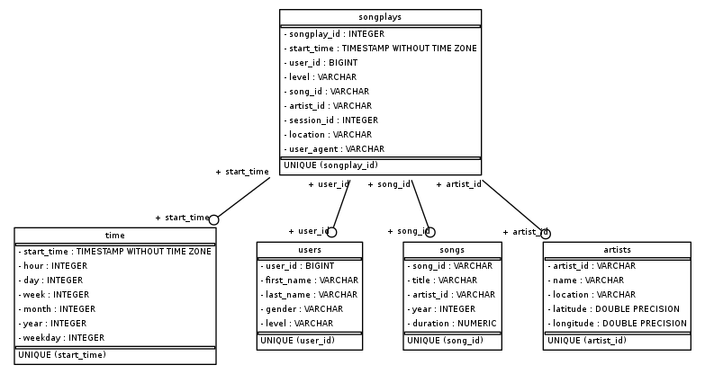

## DATABASE DESIGN:

This database for Sparkify was designed to store user usage data as well as catalog information about artists and songs. The data will be used to analyze customer trends and tastes. The data could be enriched to provide recommendations and custom playlists for users based on their listening history.

A snapshot of the database schema is shown below:

## HOW TO:
1) In the AWS console, create an S3 bucket to be used for outputting the final tables. Copy the bucket URI for later use.

2) Open the `dl.cfg` file and input your AWS credentials as well as your output S3 bucket. Your file should look like this:

`[AWS]
AWS_ACCESS_KEY_ID=<YOUR_AWS_ACCESS_KEY>
AWS_SECRET_ACCESS_KEY=<YOUR_AWS_SECRET_ACCESS_KEY>
AWS_SESSION_TOKEN=<YOUR_AWS_SESSION_TOKEN_IF_NEEDED>

[S3]
INPUT_DATA = 's3a://udacity-dend/'
OUTPUT_DATA = <YOUR_OUTPUT_S3_BUCKET>`

3) Open a terminal and run the following command:

`python etl.py`

4) Check in S3 to make sure your parequetted data was output properly.

## FILES:

Detailed information about the songs in the Sparkify catalog is located at `s3://udacity-dend/song_data`. In this bucket are json files with the following information:

`num_songs
artist_id
artist_latitude
artist_longitude
artist_location
artist_name
song_id
title
duration
year
`
The Sparkify user logs are located at `s3://udacity-dend/log_data`. In this bucket are json files partitioned by day with all user app interactions that Sparkify collects. The fields are:

`artist
auth
firstName
gender
itemInSession
lastName
length
level
location
method
page
registration
sessionId
song
status
ts
userAgent
userId
`

## SCHEMA:

A star schema design was chosen to enable easy querying of session and song level listening data, particularly around session duration and song/artist frequencies.
